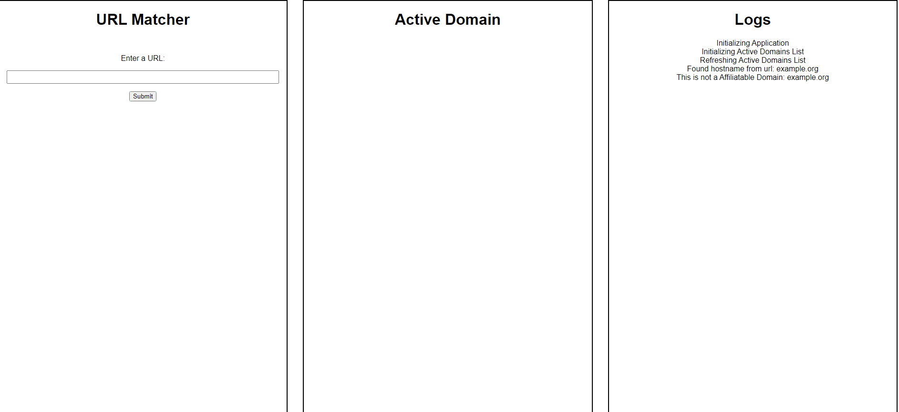
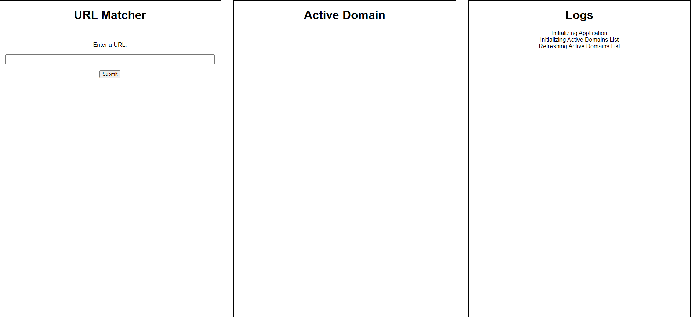

# Example: Match Active Domain

Use this as a guideline for utilizing the Wildlink Library's getDomains functionality.

## Get Started

1.  Install dependencies:

    ```
    yarn install
    ```

1.  Insert the Secret and Application ID provided by Wildlink into `index.js` on Line 21.

    ```js
      initialize = async () => {
        try {
          logger('Initializing Application');

          // Here 👇
          // The first argument is the Secret provided by Wildlink
          // The second argument is the Application ID provided by Wildlink
          const client = new WildlinkClient('SECRET', 0);

          await client.init();
          const activeDomains = new ActiveDomains(client, logger);
          await activeDomains.initialize();
          await activeDomains.watch();
          this._client = client;
          this._activeDomains = activeDomains;
          this.addEventListeners();
        } catch (err) {
          console.error(err);
          logger('Failed to initialize Application');
        }
      };
    ```

1.  Build the `main.js`

    ```
    yarn build
    ```

1.  Open `index.html` in your browser.

## How to use the application

1. Copy any URL and enter it into the form on the left.

    If a url matches the active domain's list, then it will display the matched active domain you will use to match the vanity.

    <p align="center">
      
    </p>

    If the url fails to match the active domain's list, then it will pop a message in the logger.

    <p align="center">
      
    </p>

## How it works

1. Handling the Active Domains Data Set

    The Wildlink Library provides us with a large array of active domains:

    ```js
    [
      {
        ID: 1991737,
        Domain: "target.com",
        Merchant: {
          ID: 5482877,
          Name: "Target",
          DefaultRate: {
            Kind: "PERCENTAGE",
            Amount: "0.5",
          },
          DerivedRate: {
            Kind: "PERCENTAGE",
            Amount: "0.75",
          },
          MaxRate: {
            Kind: "PERCENTAGE",
            Amount: "0.5",
          }
        }
      },
      {
        ID: 5834,
        Domain: "verizon.com",
        Merchant: {
          ID: 7000,
          Name: "Verizon Business Markets",
          DefaultRate: {
            Kind: "FLAT",
            Amount: "15",
            Currency: "USD",
          },
          DerivedRate: null,
          MaxRate: {
            Kind: "FLAT",
            Amount: "15",
            Currency: "USD",
          },
        }
      },
      ...
    ]
    ```

    In this implementation, we build a module that can maintain the list of active domains every 24 hours, and converts our array of active domains into a map for a faster lookup time.

    ```js
      watch = () => {
        setInterval(
          this._reloadDomains,
          1000 * 60 * 60 * 24,
        );
      };

      _reloadDomains = async () => {
        try {
          this._logger('Refreshing Active Domains List');
          const data = await this._client.getDomains();
          const domains = {};
          data.forEach((d) => (domains[d.Domain] = d)); // <-- We convert the array into a map
          this._domains = domains;
        } catch (err) {
          this._logger('Error Fetching Active Domains List');
          console.error(err);
        }
      };
    ```

    With this function we turn this:

    ```js
    [
      {
        ID: 5834,
        Domain: "verizon.com",
        Merchant: {
          ID: 7000,
          Name: "Verizon Business Markets",
          DefaultRate: {
            Kind: "FLAT",
            Amount: "15",
            Currency: "USD",
          },
          DerivedRate: null,
          MaxRate: {
            Kind: "FLAT",
            Amount: "15",
            Currency: "USD",
          },
        }
      },
      ...
    ]
    ```

    Into this:

    ```js
    {
      "verizon.com": {
        ID: 5834,
        Domain: "verizon.com",
        Merchant: {
          ID: 7000,
          Name: "Verizon Business Markets",
          DefaultRate: {
            Kind: "FLAT",
            Amount: "15",
            Currency: "USD",
          },
          DerivedRate: null,
          MaxRate: {
            Kind: "FLAT",
            Amount: "15",
            Currency: "USD",
          },
        }
      },
      ...
    }
    ```

    We do this every 24 hours to reduce load times by maintaining the active domains in memory. The active domains list is a large data set, so it is a good idea to keep it in memory rather than requesting the list everytime you would like to check if a url is an Eligible Merchant.


2. Pulling a Hostname from a URL

    In this implementation we use the URL class provided to use by the browser. ( It is available in the node.js runtime as well )

    ```js
      extractDomain = (url) => {
        try {
          let { hostname } = new URL(url);
          if (hostname.startsWith('www.')) {
            hostname = hostname.replace('www.', '');
          }
          return hostname;
        } catch (err) {
          console.error(err);
          return null;
        }
      };
    ```

    This function pulls the hostname from the url, and if it begins with `www.` we strip it and return the hostname alone.

    Example:

    ```js
      this.extractDomain('http://example.org/') // --> 'example.org'
    ```


3. Finding an Active Domain using the Hostname

    If you converted the Active Domains list into a map, like in this example you can just pass in the key as a string to retrieve the active domain.

    ```js
      get = (host) => {
        return this._domains[host] || null;
      };
    ```

    Examples:

    Host that **is not** a part of our active domain's list

    ```js
      this.get('example.org') // --> null
    ```

    Host that **is** part of our active domain's list

    ```js
      this.get('example.org') // --> ActiveDomain Object {}
    ```

    If you chose to use the Active Domains list directly from the api your implementation may look something like this:

    ```js
      get = (host) => {
        for( let i = 0; i < this._domains.length; i++ ) {
          const activeDomain = this._domains[i]
          if (activeDomain.Domain === host) {
            return activeDomain
          }
        }
        return null
      };
    ```
